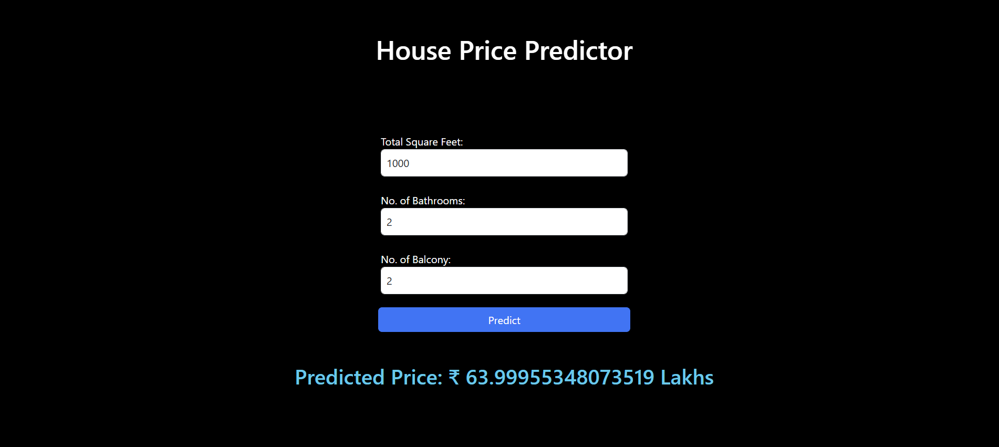
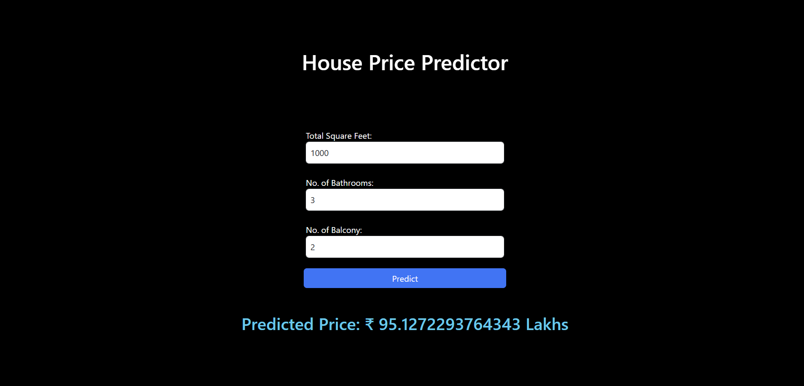
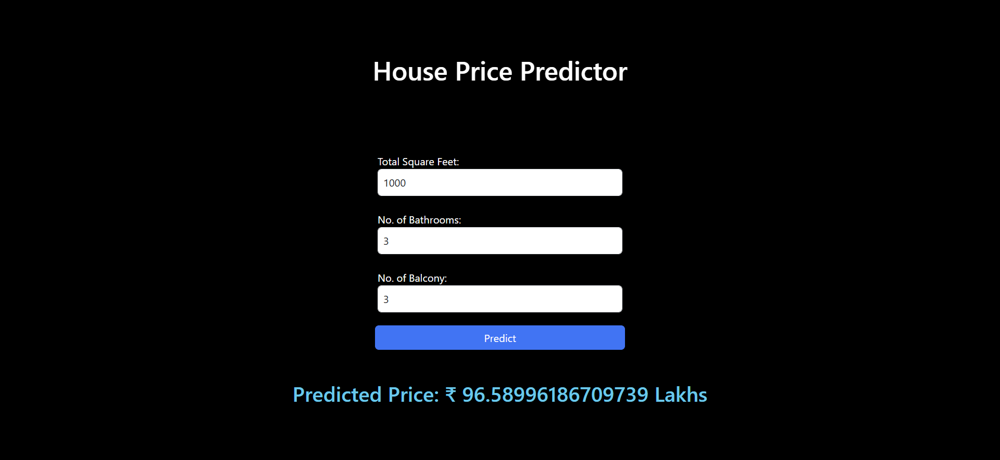
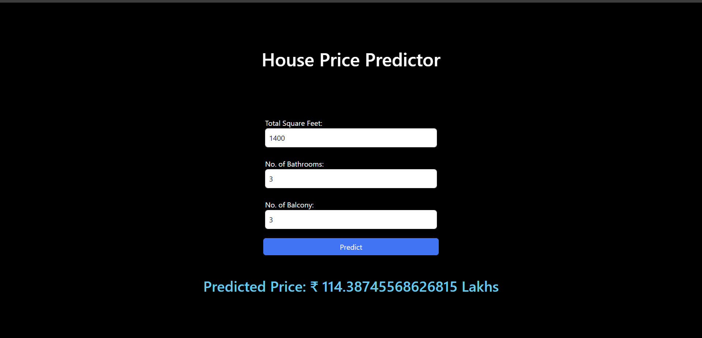

# house-price-prediction
Implemented linear regression from scratch to better understand the mathematics behind gradient descent before using Scikit-learn, used a dataset from Kaggle. The Bangalore dataset has 9 features, namely: area_type, availability, location, size, society, total_sqft, bath, balcony, and price.
***

## Stack Used
#### Python . Numpy . Pandas . Matplotlib . Flask . HTML . CSS

***
## Problems I Faced
#### 1) total_sqft feature
- It had approximate string values like "3067 - 8156". I solved this problem by defining a function, convert_sqft_to_num, which converts the approximate values and returns their average.

- The total_sqft column had values like 34.46Sq. Meter, 5.31Acres, 1574Sq. Yards, 3Cents, 2.09Acres, 24Guntha, 1Grounds which were removed from the data because they were very few.

- Before removing the rows with values other than raw numbers 12711 
- After removing: 12669

#### 2) Virtual Environment
I couldn't install pandas, matplotlib, and other libraries in the WSL environment due to version compatibility issues. Hence, I had to create a virtual environment. However, it is a bit hectic since I have to activate the virtual environment every time I wanted to run the code.

***
## Results

### 📌 Version 1

#### Features Used
- `total_sqft`
- `bath`
- `bhk`

### Target
- `price`

### Training Results

| Metric | Value |
|---------|------:|
| MAE | 0.333 |
| RMSE | 0.675 |
| R² Score | 0.426 |

### Learned Parameters

```
Weights:
total_sqft : 0.3958
bath       : 0.2890
bhk        : 0.0091

Bias:
-0.0017
```

### Observations

- The model successfully learned meaningful relationships from the dataset.
- `total_sqft` had the strongest influence on the predicted price.
- The training loss converged from **0.9561** to **0.6131**.
- The model currently uses only numerical features; location information has not yet been incorporated.

<p align="center">
    
    
</p>

<p align="center">
    
    
</p>

- As we can see, as I increase square feet, no. of bathroom or no. of balcony the price is increasing which shows that the model has learnt, and as the weights given above, the price depends on sqft the most then bathroom then balcony

- End of version 1 !
***

### 📌 Version Two

- Add location as a feature
- Implement one-hot encoding from scratch
- Save and load trained model parameters
- Improve Flask UI
- Compare results with Scikit-Learn's Linear Regression
- Improve preprocessing by converting uncommon area units instead of dropping them

***
## Things I Did

#### 1) Implemented a supervised learning model from scratch
I know using a standard model like Scikit-learn is better, but I am planning to add that as well so I can compare the results with my implementation.

#### 2) Functions and files used
- fit(): Used gradient descent to find the optimal values of w and b.
- load_data(): Used to load the dataset.
- preprocess.py: Used to preprocess the data, i.e., split the dataset into training and testing sets.
- train.py: Contains all the final functions required for training the model.
- app.py: Contains the final version of the project and connects the backend logic with the frontend using Flask.
- predict.py: which stands as a direct logic behind UI.

#### 3) Folders Used
- data: Contains the dataset.
- src: Contains all the Python files used to implement the project.
- templates: Contains the HTML files for the UI.
- static: Contains the JavaScript files (JavaScript hasn't been used yet).
***

# Thank You For Viewing My Project, it will be deployed locally very soon.