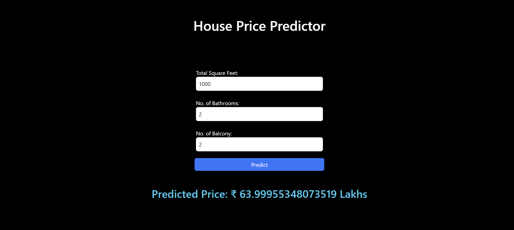
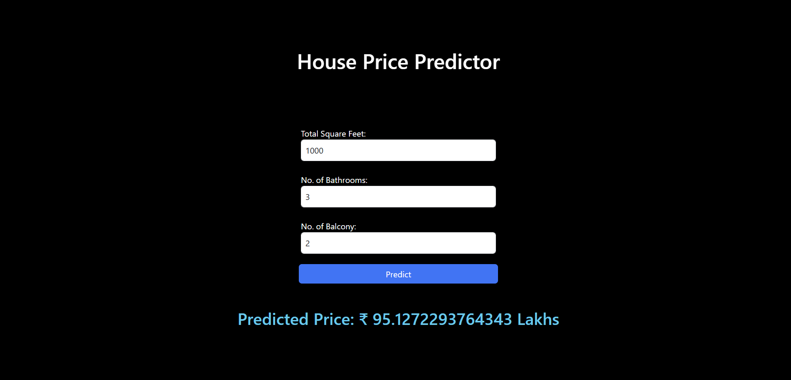
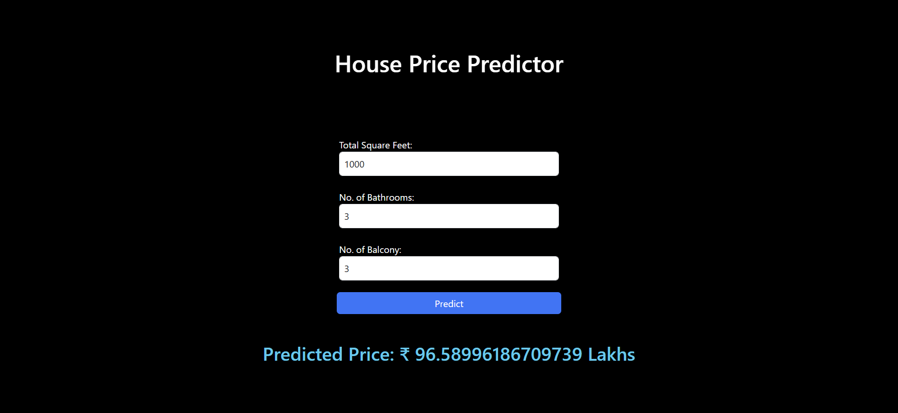
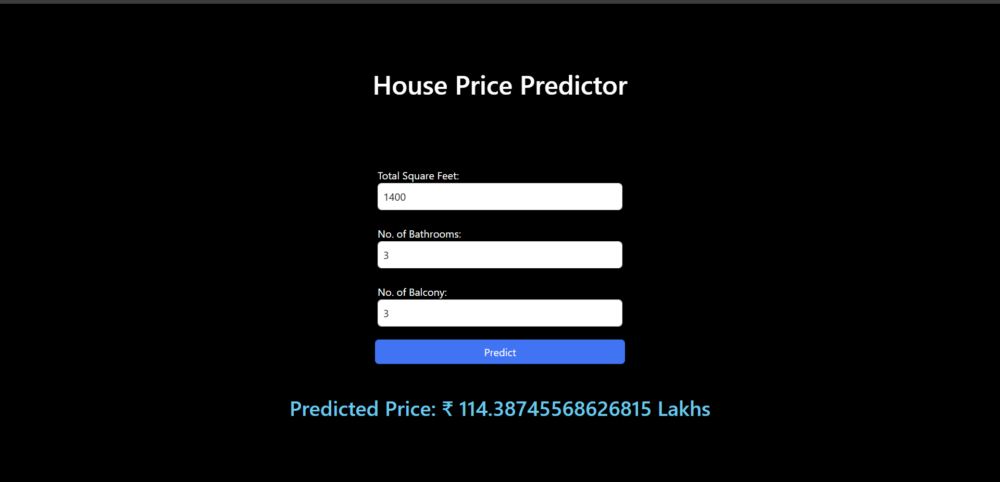

# house-price-prediction

Implemented Linear Regression from scratch to better understand the mathematics behind gradient descent . The dataset used for this project was obtained from Kaggle.
***
 
## [Live (Click here)](https://house-price-prediction-3eqx.onrender.com/)

## Stack Used

#### . Python . Numpy . Pandas . Machine Learning . Flask . HTML . CSS

The original Bangalore house-price dataset contains 9 columns:

* `area_type`
* `availability`
* `location`
* `size`
* `society`
* `total_sqft`
* `bath`
* `balcony`
* `price`

For the model, I used **7 features** because `availability` and `society` were not considered useful for the prediction task.

## Data Cleaning

The original dataset contained **13,320 rows**. After removing rows containing null values, **12,710 rows** remained.

| Metric                    |  Value |
| ------------------------- | -----: |
| Original rows             | 13,320 |
| Rows after removing nulls | 12,710 |
| Rows removed              |    610 |
| Percentage removed        | ~4.58% |

The decrease in the number of unique values for each column was:

| Column       | Unique values removed |
| ------------ | --------------------: |
| `total_sqft` |                   141 |
| `bath`       |                     4 |
| `balcony`    |                     1 |
| `location`   |                    41 |
| `size`       |                     5 |
| `area_type`  |                     0 |

### Insights

* **`total_sqft`** lost 141 unique values. This is not particularly concerning because `total_sqft` contains many values that are unique or occur only a small number of times. Losing some unique values does not necessarily remove significant information from the dataset.

* **`bath`** lost 4 unique values and **`balcony`** lost 1 unique value. Although unique categories were removed, the important factor is how many observations belonged to those values. Since only 610 rows were removed overall, the impact on the dataset is relatively small.

* **`location`** lost 41 unique values. This is expected because some locations had relatively few observations, and removing rows with missing values can eliminate locations that were represented by only a small number of houses.

* **`size`** lost 5 unique values, while `area_type` did not lose any unique values.

Overall, only **610 out of 13,320 rows (~4.58%)** were removed during null-value cleaning. Therefore, the majority of the original dataset was retained for model training.

***

## Results

### 📌 Version 1

#### Training Results

| Metric | Value |
|---------|------:|
| MAE | 0.333 |
| RMSE | 0.675 |
| R² Score | 0.426 |

#### Observations

- The model successfully learned meaningful relationships from the dataset.
- `total_sqft` had the strongest influence on the predicted price.
- The training loss converged from **0.9561** to **0.6131**.
- The model currently uses only numerical features; location information has not yet been incorporated.

    
    

    
    

- As we can see, as I increase square feet, no. of bathroom or no. of balcony the price is increasing which shows that the model has learnt, and as the weights given above, the price depends on sqft the most then bathroom then balcony

***

### 📌 Version Two

###### Implemented ONE-HOT ENCODING for the location column

- One-hot encoding involves the process of converting a column containing different locations into multiple columns, where the value is 1 if the house belongs to that location and 0 otherwise.
- I used only the locations with more than 10 occurrences in the dataset. Locations with 10 or fewer occurrences were grouped into an other category, as the model would not have enough data to learn meaningful patterns from such few samples.
- During prediction, if the selected location is not present among the learned locations, it is automatically mapped to the other category, allowing the model to still make a reasonable prediction.

###### Evaluation Metrics After One hot encoding of location column

| Metric | Value |
|--------|------:|
| Bias | -0.0034 |
| Mean Absolute Error (MAE) | 0.3041 |
| Root Mean Squared Error (RMSE) | 0.6371 |
| R² Score | 0.4579 |

##### R² Score changed from 0.426 to 0.4579 which shows that the model improved its efficiency.

***

## Problems I Faced
#### 1) total_sqft feature
- It had approximate string values like "3067 - 8156". I solved this problem by defining a function, convert_sqft_to_num, which converts the approximate values and returns their average.

- The total_sqft column had values like 34.46Sq. Meter, 5.31Acres, 1574Sq. Yards, 3Cents, 2.09Acres, 24Guntha, 1Grounds which were removed from the data because they were very few.

- Before removing the rows with values other than raw numbers 12711 
- After removing: 12669

#### 2) Virtual Environment
- I couldn't install pandas, matplotlib, and other libraries in the WSL environment due to version compatibility issues. Hence, I had to create a virtual environment. However, it is a bit hectic since I have to activate the virtual environment every time I wanted to run the code.

#### 3) One Hot encoding
- Took a lot of time in understanding One hot encoding.

***

## Things I Did

#### 1) Implemented a supervised learning model from scratch
I know using a standard model like Scikit-learn is better, but I am planning to add that as well so I can compare the results with my implementation.

#### 2) Functions and files used
- fit(): Used gradient descent to find the optimal values of w and b.
- load_data(): Used to load the dataset.
- preprocess.py: Used to preprocess the data, i.e., split the dataset into training and testing sets.
- train.py: Contains all the final functions required for training the model.
- app.py: Contains the final version of the project and connects the backend logic with the frontend using Flask.
- predict.py: which stands as a direct logic behind UI.

#### 3) Folders Used
- data: Contains the dataset.
- src: Contains all the Python files used to implement the project.
- templates: Contains the HTML files for the UI.
- static: Contains the JavaScript files (JavaScript hasn't been used yet).
***

# Thank You
